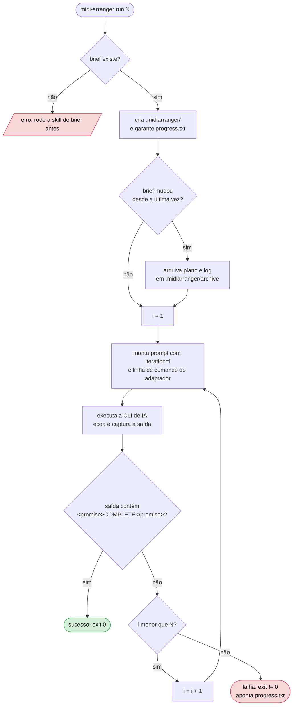
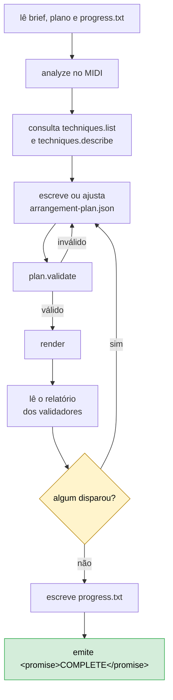
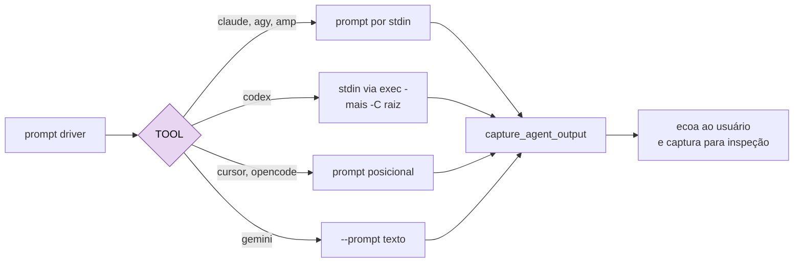
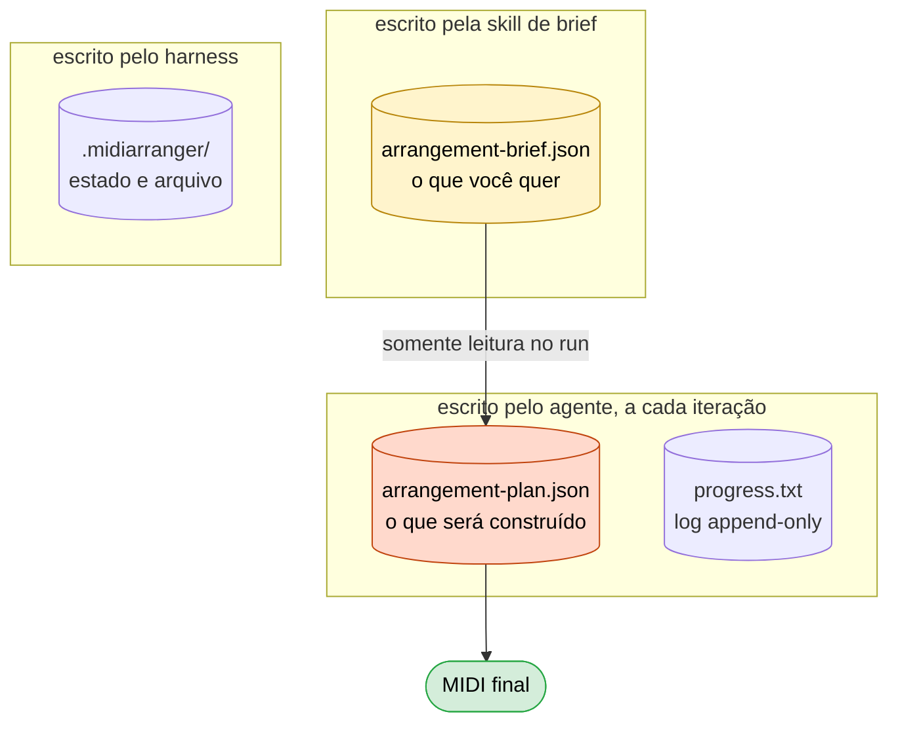

# Fluxo do harness

> **Este documento é obrigatório e vinculado ao código.** Um teste automatizado compara o hash de
> `bin/midi-arranger` com o registrado no fim deste arquivo. Mexeu no harness sem atualizar aqui, a
> suíte quebra. Ver [Manter em dia](#manter-em-dia).

O harness não implementa laço de agente, não fala com SDK de provider e não usa MCP. Ele **monta uma
linha de comando e a executa** — a CLI de IA que você já tem faz o trabalho.

---

## 1. As duas fases

A entrevista precisa de conversa; o loop precisa ser headless. Por isso são duas fases, exatamente
como `/prd` e `ralph`.

| Fase | Onde roda | Interativa? | Produz |
|---|---|---|---|
| `brief` | skill dentro do provider | sim, conversa | `arrangement-brief.json` |
| `run` | `bin/midi-arranger` | não, headless | o MIDI + plano + relatório |

---

## 2. O laço `run`

Cada iteração é um **processo novo, sem memória da anterior**. Todo estado vive em disco. Quando o
usuário não informa `max_iterations`, o default é 10; a ajuda recomenda estimar uma iteração por
família de instrumento a arranjar, mais folga para correções.

O harness procura apenas a sentinela literal `<promise>COMPLETE</promise>` na saída capturada da
iteração recém-executada. Encontrou, encerra com código 0. **Estourar as iterações é falha**, com
código de saída diferente de zero e ponteiro para `progress.txt`. O harness nunca finge sucesso nem
consulta `progress.txt` para decidir se acabou.
Antes de chamar qualquer CLI, `run` exige `arrangement-brief.json`, cria `.midiarranger/` quando
necessário e compara o hash atual do brief com `.midiarranger/brief.sha256`. Se o hash mudou desde a
última execução, o harness move o `arrangement-plan.json` e o `progress.txt` anteriores para
`.midiarranger/archive/<data>-<slug>/`, onde o slug vem do MIDI citado no brief quando isso está
disponível. Só depois disso ele grava o novo hash, garante que `progress.txt` exista e acrescenta a
entrada de início de execução. Se o hash do brief é o mesmo, nada é arquivado: o log existente é
preservado e recebe append.

---

## 3. O que o agente faz dentro de uma iteração

O harness não sabe nada disso — quem sabe é o prompt driver. Está aqui para você entender o todo.

O ciclo `H → D` é o que garante que nada sai com validador reclamando. A sentinela só é emitida
quando **todos** passam, inclusive o de conformidade, que confere se o construído atende o brief.

---

## 4. O adaptador por ferramenta

Cada CLI recebe prompt e flags de um jeito. O adaptador absorve a diferença; o resto do harness não
sabe qual ferramenta está ativa.

| Ferramenta | Prompt | Operação autônoma | Effort |
|---|---|---|---|
| `claude` | stdin | `--print --dangerously-skip-permissions` | `--effort` |
| `codex` | stdin via `exec -` | `--dangerously-bypass-approvals-and-sandbox -C <raiz>` | `-c model_reasoning_effort` |
| `agy` | stdin | `--print --dangerously-skip-permissions` | `--effort` |
| `cursor` | posicional | `--print --force` | dentro da string do modelo |
| `opencode` | posicional | `run --auto` | `--variant` |
| `amp` | stdin | `--dangerously-allow-all` | não suporta |
| `gemini` | `--prompt` | `--approval-mode yolo` | não suporta |

Três regras que valem para todos:

- **Nenhum modelo é fixado no código.** Sem `--model`, nada é passado adiante e a CLI usa o default
  que você configurou. Fixar modelo sobrescreveria sua escolha em silêncio e envelheceria a cada
  lançamento.
- **Effort só vai quando pedido explicitamente**, exceto onde a ferramenta exige.
- **O agente sempre roda na raiz do projeto.** O harness faz `cd` antes de invocar, porque o prompt
  anuncia `project_root` e o agente precisa ler e escrever ali — não no diretório de onde você
  chamou o comando.

---

## 5. Estado em disco

Contexto limpo a cada iteração significa que **arquivo é a única memória**.

| Arquivo | Papel | Quem escreve |
|---|---|---|
| `arrangement-brief.json` | O que você quer. **Somente leitura durante o `run`** | a skill de brief |
| `arrangement-plan.json` | O que será construído. **Fonte de verdade da conclusão** | o agente |
| `progress.txt` | O que cada iteração fez. Só log — nunca consultado para decidir se acabou | o agente |
| `.midiarranger/` | Última execução e arquivo das anteriores | o harness |

**O brief é contrato.** Se o agente concluir que ele está errado, ele para e reporta — nunca
reescreve o que você pediu. Requisito novo é brief novo.

No começo do `run`, o harness valida que `arrangement-brief.json` existe antes de invocar o agente.
Sem brief, o comando falha cedo e manda rodar `midi-arranger brief <input.mid>`. Com brief presente,
o harness cria `.midiarranger/`, registra o hash do brief em `.midiarranger/brief.sha256` e usa esse
valor para detectar se a demanda mudou desde a execução anterior.

Quando o brief muda, um plano ou log antigo pode pertencer a outra música. Para evitar reutilização
silenciosa, o harness arquiva `arrangement-plan.json` e `progress.txt` em
`.midiarranger/archive/<data>-<slug>/` antes de recriar o log. Quando o brief não mudou,
`progress.txt` continua append-only: o conteúdo anterior fica no lugar e recebe uma nova entrada de
início de execução.

---

## 6. Manter em dia

Este documento é verificado por teste. O hash abaixo é o do `bin/midi-arranger` no momento em que a
doc foi revisada pela última vez.

Ao mexer no harness:

1. Atualize as seções deste arquivo que descrevem o que mudou.
2. Rode `scripts/update-flow-lock.sh` para gravar o hash novo.
3. Commite os dois juntos.

Se você pular o passo 1, o teste ainda vai passar — o hash não sabe se o texto ficou correto. O que
ele garante é que **ninguém muda o harness sem passar por aqui e olhar**. O resto é honestidade.

<!-- harness-sha256: 69e59ea316648f4912be1eaf731efc5f71d2362eaa113344e1313cbe319fb514 -->
