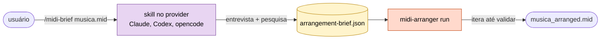
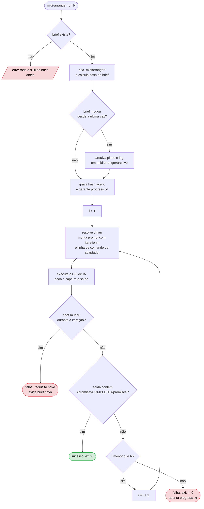
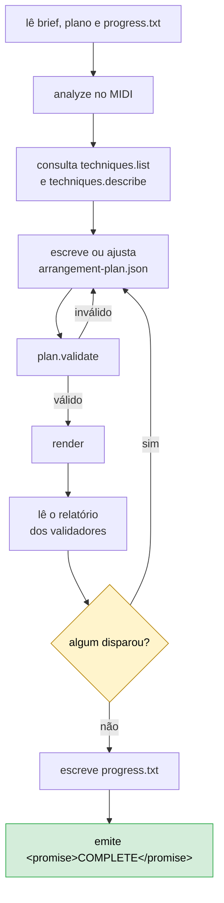
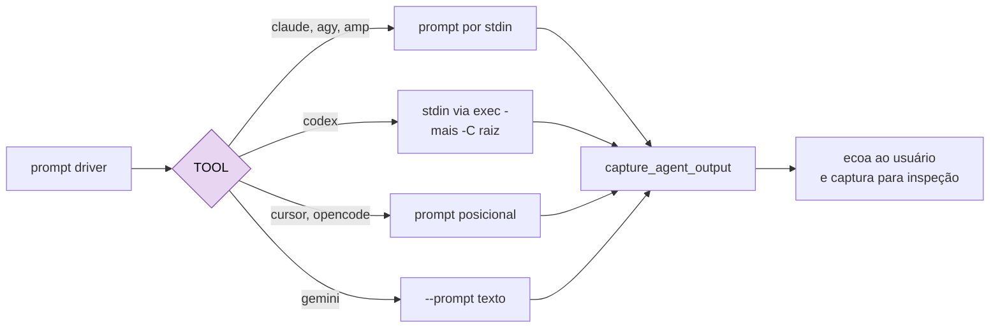
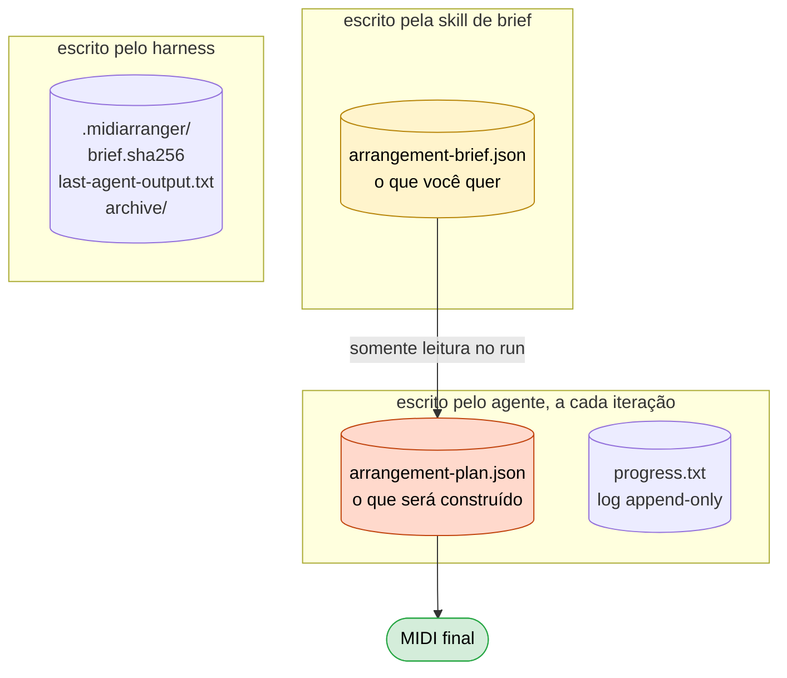
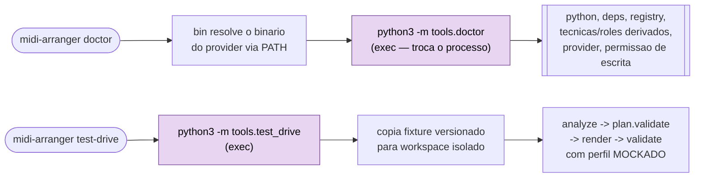

# Fluxo do harness

> **Este documento é obrigatório e vinculado ao código.** Um teste automatizado compara o hash de
> `bin/midi-arranger` com o registrado no fim deste arquivo. Mexeu no harness sem atualizar aqui, a
> suíte quebra. Ver [Manter em dia](#manter-em-dia).

O harness não implementa laço de agente, não fala com SDK de provider e não usa MCP. Ele **monta uma
linha de comando e a executa** — a CLI de IA que você já tem faz o trabalho.

---

## 1. As duas fases

A entrevista precisa de conversa; o loop precisa ser headless. Por isso são duas fases, exatamente
como `/prd` e `ralph`.

| Fase | Onde roda | Interativa? | Produz |
|---|---|---|---|
| `brief` | skill dentro do provider | sim, conversa | `arrangement-brief.json` |
| `run` | `bin/midi-arranger` | não, headless | o MIDI + plano + relatório |

---

## 2. O laço `run`

Cada iteração é um **processo novo, sem memória da anterior**. Todo estado vive em disco. Quando o
usuário não informa `max_iterations`, o default é 10; a ajuda recomenda estimar uma iteração por
família de instrumento a arranjar, mais folga para correções.

O harness procura apenas a sentinela de conclusão na saída capturada da iteração recém-executada. Ela
é formada por `<promise>` + `COMPLETE` + `</promise>`, mas só é aceita depois de conferir que
`arrangement-brief.json` continuou igual ao hash aceito no início do `run`. Se o agente alterar ou
remover o brief durante uma iteração, o harness para com erro: requisito novo exige rodar a fase de
brief de novo. Encontrou a sentinela com o brief intacto, encerra com código 0.
**Estourar as iterações é falha**, com código de saída
diferente de zero e ponteiro para `progress.txt`. O harness nunca finge sucesso nem consulta
`progress.txt` para decidir se acabou.
Antes de chamar qualquer CLI, `run` exige `arrangement-brief.json`, cria `.midiarranger/` quando
necessário e compara o hash atual do brief com `.midiarranger/brief.sha256`. Se o hash mudou desde a
última execução, o harness move o `arrangement-plan.json` e o `progress.txt` anteriores para
`.midiarranger/archive/<data>-<slug>/`, onde o slug vem do MIDI citado no brief quando isso está
disponível. Se nenhum desses arquivos existir, o diretório de arquivo vazio é removido. Só depois
disso ele grava o novo hash, garante que `progress.txt` exista e acrescenta a entrada de início de
execução. Se o hash do brief é o mesmo, nada é arquivado: o log existente é preservado e recebe
append.

---

## 3. O que o agente faz dentro de uma iteração

O harness não sabe nada disso — quem sabe é o prompt driver. Está aqui para você entender o todo.

O ciclo `H → D` é o que garante que nada sai com validador reclamando. A sentinela só é emitida
quando **todos** passam, inclusive o de conformidade, que confere se o construído atende o brief.

---

## 4. Resolucao do prompt driver

O `run` resolve o driver antes de chamar a CLI de IA. Por padrao, a ferramenta ativa escolhe o
arquivo em `prompts/<TOOL>.md`, com o nome da ferramenta em maiusculas: `claude` usa
`prompts/CLAUDE.md`, `codex` usa `prompts/CODEX.md`, e assim por diante. O conteudo desse arquivo
entra no prompt entregue ao agente depois dos campos de estado da iteracao.

O usuario pode substituir o driver sem bifurcar o repositorio definindo
`MIDI_ARRANGER_PROMPT_FILE=/caminho/para/driver.md`. Esse arquivo tem precedencia sobre
`prompts/<TOOL>.md`. Se o caminho apontado pela variavel nao existir, o harness falha com erro claro
e nao cai silenciosamente no driver padrao. Se o driver padrao da ferramenta escolhida estiver
ausente, o `run` tambem falha antes de invocar a CLI.

O `brief` ainda usa apenas o prompt curto com `input_midi`; os drivers em `prompts/` sao do loop
headless de `run`.

## 5. O adaptador por ferramenta

Cada CLI recebe prompt e flags de um jeito. O adaptador absorve a diferença; o resto do harness não
sabe qual ferramenta está ativa.

| Ferramenta | Prompt | Operação autônoma | Effort |
|---|---|---|---|
| `claude` | stdin | `--print --dangerously-skip-permissions` | `--effort` |
| `codex` | stdin via `exec -` | `--dangerously-bypass-approvals-and-sandbox -C <raiz>` | `-c model_reasoning_effort` |
| `agy` | stdin | `--print --dangerously-skip-permissions` | `--effort` |
| `cursor` | posicional | `--print --force` | dentro da string do modelo |
| `opencode` | posicional | `run --auto` | `--variant` |
| `amp` | stdin | `--dangerously-allow-all` | não suporta |
| `gemini` | `--prompt` | `--approval-mode yolo` | não suporta |

Três regras que valem para todos:

- **Nenhum modelo é fixado no código.** Sem `--model`, nada é passado adiante e a CLI usa o default
  que você configurou. Fixar modelo sobrescreveria sua escolha em silêncio e envelheceria a cada
  lançamento.
- **Effort só vai quando pedido explicitamente**, exceto onde a ferramenta exige.
- **O agente sempre roda na raiz do projeto.** O harness faz `cd` antes de invocar, porque o prompt
  anuncia `project_root` e o agente precisa ler e escrever ali — não no diretório de onde você
  chamou o comando.

---

## 6. Estado em disco

Contexto limpo a cada iteração significa que **arquivo é a única memória**.

| Arquivo | Papel | Quem escreve |
|---|---|---|
| `arrangement-brief.json` | O que você quer. **Somente leitura durante o `run`** | a skill de brief |
| `arrangement-plan.json` | O que será construído. **Fonte de verdade da conclusão** | o agente |
| `progress.txt` | O que cada iteração fez. Só log — nunca consultado para decidir se acabou | o agente |
| `.midiarranger/` | `brief.sha256`, última saída capturada e arquivo das execuções anteriores | o harness |

**O brief é contrato.** Se o agente concluir que ele está errado, ele para e reporta — nunca
reescreve o que você pediu. Requisito novo é brief novo.

No começo do `run`, o harness valida que `arrangement-brief.json` existe antes de invocar o agente.
Sem brief, o comando falha cedo e manda rodar `midi-arranger brief <input.mid>`. Com brief presente,
o harness cria `.midiarranger/`, registra o hash do brief em `.midiarranger/brief.sha256` e usa esse
valor para detectar se a demanda mudou desde a execução anterior. Esse valor é o SHA-256 dos bytes
exatos do arquivo, sem parse nem normalização de JSON; quando o pacote `tools/` está disponível, o
harness chama `tools.brief_ref.brief_sha256()`, e cai para `shasum -a 256` só como fallback de
ambiente.

Durante o `run`, esse mesmo hash vira uma trava de somente leitura. O prompt driver passa
`brief_readonly=true` e instrui o agente a não editar `arrangement-brief.json`; se o agente mudar o
arquivo mesmo assim, o harness detecta ao fim da iteração e falha antes de aceitar qualquer sentinela
de conclusão.

Quando o brief muda, um plano ou log antigo pode pertencer a outra música. Para evitar reutilização
silenciosa, o harness arquiva `arrangement-plan.json` e `progress.txt` em
`.midiarranger/archive/<data>-<slug>/` antes de recriar o log. Quando o brief não mudou,
`progress.txt` continua append-only: o conteúdo anterior fica no lugar e recebe uma nova entrada de
início de execução.

---

## 7. `doctor` e `test-drive`

Dois subcomandos deterministicos (issue #78) que existem para o musico validar o ambiente local
antes de rodar `brief`/`run` de verdade — nenhum dos dois invoca a CLI de IA.

`bin/midi-arranger` so resolve o que ja resolvia antes (o binario do provider escolhido via
`--tool`, com a mesma logica de `tool_binary_path`) e delega o resto a `tools/doctor.py` e
`tools/test_drive.py` via `exec python3 -m <modulo>` — o processo bash e substituido, entao o codigo
de saida do modulo em Python vira o codigo de saida do comando, sem passar pelos sysexits do resto
deste script.

`doctor` confere Python >= 3.11, as dependencias `mido`/`pretty_midi`, se o registry de tools importa
e registra sem erro, o inventario de tecnicas/roles CURRENTE do motor (derivado de
`tools.techniques.engine.SUPPORTED_TECHNIQUES` e `tools.render.SUPPORTED_ROLES`, nunca hardcoded),
se o binario do provider escolhido esta em PATH e e executavel, e permissao de escrita na raiz do
projeto e em `.midiarranger/`. Ele so declara que a capacidade de pesquisa web depende da propria CLI
de IA do usuario — nunca testa acesso de rede de verdade.

`test-drive` copia o fixture `tests/fixtures/corpus_drums/ENTRE NÓS.mid` (ou `--fixture` informado)
para um workspace temporario isolado — o fixture original nunca e aberto para escrita — e roda o
subconjunto do fluxo de 10 passos que ja e maquinario puro hoje: `analyze` → (perfil de estilo
MOCKADO, sem pesquisa) → `plan.validate` → `render` → `validate`. Produz MIDI renderizado, plano e
relatorio no workspace; sem `--keep`, o workspace e apagado ao final.

Codigo de saida dos dois, documentado em `python -m tools.doctor`/`python -m tools.test_drive`:

| Codigo | Significado |
|---|---|
| `0` | ambiente saudavel / fluxo completo sem erro de validacao musical |
| `1` | (so `test-drive`) o fluxo rodou, mas um validador reportou severidade `error` |
| `2` | falha de ambiente — dependencia faltando, provider ausente, fixture ausente, sem permissao de escrita |

---

## 8. Manter em dia

Este documento é verificado por teste. O hash abaixo é o do `bin/midi-arranger` no momento em que a
doc foi revisada pela última vez.

Ao mexer no harness:

1. Atualize as seções deste arquivo que descrevem o que mudou.
2. Rode `scripts/update-flow-lock.sh` para gravar o hash novo.
3. Commite os dois juntos.

Se você pular o passo 1, o teste ainda vai passar — o hash não sabe se o texto ficou correto. O que
ele garante é que **ninguém muda o harness sem passar por aqui e olhar**. O resto é honestidade.

<!-- harness-sha256: 6eb258036cbd1d5bda85e798e956d189cfb04c08a2ea097286a96ca63443439a -->
