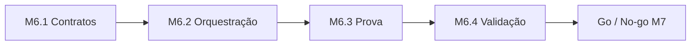
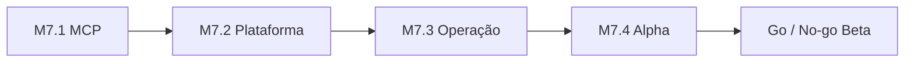
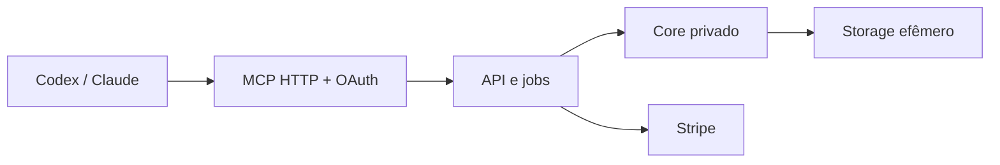

# Roadmap

Este documento organiza a evolução do `midi.arranger.cli` desde o maquinário local atual até um
produto comercial conectado à IA do próprio usuário.

A fonte de verdade de comportamento continua em
[`docs/objetivo.md`](objetivo.md) e [`docs/arquitetura.md`](arquitetura.md). Este arquivo define
**ordem, escopo e critérios de passagem entre fases**.

---

## Visão do produto

O produto recebe um MIDI existente e uma intenção musical. A IA que o usuário já utiliza pesquisa
referências públicas, identifica características abstratas de performance e coordena o fluxo. O
maquinário determinístico traduz essas características para técnicas próprias, constrói ou remodela
o MIDI e comprova o resultado.

A ferramenta trabalha com **influências, técnicas e comportamento**, nunca com reprodução de
melodia, riff, groove, progressão, transcrição ou arranjo reconhecível de uma obra.

### Fronteira fundamental

| Parte | Responsabilidade |
|---|---|
| IA do usuário | entrevista, pesquisa, interpretação, decisões e revisão |
| Contrato de influência | fontes, findings normalizados, confiança e achados não mapeados |
| Compilador semântico | de-para determinístico entre traços e técnicas executáveis |
| Core | análise, criação, remodelagem, humanização e render |
| Validadores | conformidade, não-cópia, harmonia, placement, persona, artificialidade e colisão |

Nenhum LLM é necessário no backend.

---

## Estado atual — 2026-08-31

A fundação já separa o harness não determinístico das tools determinísticas.

Capacidades presentes na `main`:

- analyze, brief.validate, plan.skeleton, plan.validate, render, validate,
  techniques.list, techniques.describe, plugins.scan e presets.scan;
- 24 técnicas executáveis: 8 de bateria, 7 de baixo, 5 de guitarra e 4 de teclas;
- 16 roles renderizáveis, incluindo criação de bateria, baixo e guitarra, elementos harmônicos e
  parte do eletrônico rítmico;
- autorização explícita de técnicas;
- schemas anticópia estruturais;
- render determinístico e preservação de tracks não declaradas.

Lacunas que impedem chamar o produto de MVP reference-driven:

- o catálogo ainda não distingue com clareza técnica documentada de técnica executável;
- a pesquisa ainda não produz um contrato intermediário de influência;
- falta o compilador semântico de influência para técnicas;
- parâmetros ainda vivem majoritariamente no nível da família, não da técnica;
- conformidade e não-cópia comportamental estão pendentes;
- a propagação completa do perfil de estilo e a densidade por seção ainda têm pendências;
- falta uma prova ponta a ponta e um test-drive local.

---

## Milestones existentes

### M1 — Fundação determinística

Estado: concluído.

Entregou contratos, registry, CLI de tools, análise, plano, render, validadores básicos e garantias de
determinismo/preservação.

### M2 — Harness multi-provider

Estado: concluído.

Entregou instalação, brief interativo, loop autônomo, prompts por provider e estado em disco.

### M3 — Estilo e técnicas

Estado: em andamento.

Foco atual:

- [#5 — validador de conformidade](https://github.com/OvictorVieira/midi.arranger.cli/issues/5);
- [#11 — parametrização completa pelo perfil](https://github.com/OvictorVieira/midi.arranger.cli/issues/11);
- [#14 — técnicas de teclas](https://github.com/OvictorVieira/midi.arranger.cli/issues/14);
- [#15 — validador de não-cópia](https://github.com/OvictorVieira/midi.arranger.cli/issues/15);
- [#32 — anotações locais no MIDI](https://github.com/OvictorVieira/midi.arranger.cli/issues/32);
- [#45 — densidade de ghost note por seção](https://github.com/OvictorVieira/midi.arranger.cli/issues/45).

M3 pode continuar entregando técnicas, mas M6 define quais delas são necessárias para validar o
produto com um músico.

### M4 — Criação e aprendizado

Estado: em andamento.

- criação de bateria e baixo do zero foi entregue;
- [#17](https://github.com/OvictorVieira/midi.arranger.cli/issues/17) fecha a decisão de criar família
  ausente e o respeito a vetos;
- [#18](https://github.com/OvictorVieira/midi.arranger.cli/issues/18) adicionará aprendizado por corpus
  próprio;
- [#19](https://github.com/OvictorVieira/midi.arranger.cli/issues/19) cobre guitarra.

Corpus próprio e guitarra completa ampliam o produto, mas não bloqueiam o primeiro teste
reference-driven quando a ausência de suporte é declarada honestamente.

### M5 — Eletrônico e transições

Estado: em andamento e não bloqueante para M6.

Parte do eletrônico rítmico já existe. Permanecem
[#22](https://github.com/OvictorVieira/midi.arranger.cli/issues/22),
[#23](https://github.com/OvictorVieira/midi.arranger.cli/issues/23) e
[#24](https://github.com/OvictorVieira/midi.arranger.cli/issues/24).

---

## M6 — MVP orientado por influências com a IA do usuário

Tracking: [épico guarda-chuva #80](https://github.com/OvictorVieira/midi.arranger.cli/issues/80).

### Resultado esperado

Um músico instala a ferramenta, fornece MIDI e intenção, deixa sua própria IA pesquisar referências,
revisa e autoriza o de-para, e recebe MIDI com relatório rastreável para comparar no DAW.

### Etapas

| Etapa | Épico | Entrega | Issues |
|---|---|---|---|
| M6.1 | [#84](https://github.com/OvictorVieira/midi.arranger.cli/issues/84) | Contratos e catálogo executável | #74, #75, #72 |
| M6.2 | [#83](https://github.com/OvictorVieira/midi.arranger.cli/issues/83) | Compilação e orquestração | #73, #11, #76, #17 |
| M6.3 | [#85](https://github.com/OvictorVieira/midi.arranger.cli/issues/85) | Conformidade, não-cópia e evidência | #45, #5, #15, #77 |
| M6.4 | [#87](https://github.com/OvictorVieira/midi.arranger.cli/issues/87) | Entrega local e validação real | #79, #78, #86 |

O paralelismo permitido dentro de cada etapa está documentado no respectivo épico. Uma etapa só
encerra quando todos os seus critérios de saída forem atendidos.

### Escopo suportado

- edição de bateria, baixo e teclas dentro do inventário executável;
- criação de bateria e baixo ausentes;
- elementos harmônicos e eletrônicos já disponíveis;
- pesquisa e coordenação pela IA do usuário;
- nenhuma IA hospedada pelo projeto;
- degradação explícita para capacidades ausentes.

### Fora do caminho crítico

Guitarra completa (#19), aprendizado por corpus (#18), técnicas completas de teclas (#14), expansão
eletrônica (#22, #23, #24) e anotações locais (#32) continuam no roadmap, mas não bloqueiam o MVP
quando a ausência de suporte é reportada honestamente.

### Definition of Done

- os quatro épicos M6.1–M6.4 estão concluídos;
- nenhum recurso não implementado é oferecido;
- toda influência possui fonte ou origem explícita do usuário;
- todo finding vira técnica executável ou `unmapped`;
- nenhum parâmetro técnico é inventado pela IA;
- autorização ocorre antes do render;
- conformidade e não-cópia produzem evidências;
- execução e relatório são determinísticos;
- tracks não declaradas permanecem idênticas;
- [protocolo auditivo #86](https://github.com/OvictorVieira/midi.arranger.cli/issues/86) passa em três músicas;
- entrega contém MIDI, brief, InfluenceProfile, plano e relatório;
- decisão de go/no-go para M7 é registrada em #80.

---

## M7 — Plataforma comercial MCP com core privado

Tracking: [épico guarda-chuva #81](https://github.com/OvictorVieira/midi.arranger.cli/issues/81).

M7 começa somente após M6.4 e uma decisão explícita de go. A migração preserva o contrato musical e
troca somente a forma de distribuição e operação.

### Etapas

| Etapa | Épico | Entrega principal |
|---|---|---|
| M7.1 | [#89](https://github.com/OvictorVieira/midi.arranger.cli/issues/89) | Core privado, contratos versionados e MCP HTTP |
| M7.2 | [#91](https://github.com/OvictorVieira/midi.arranger.cli/issues/91) | OAuth, multi-tenancy, arquivos efêmeros e jobs |
| M7.3 | [#88](https://github.com/OvictorVieira/midi.arranger.cli/issues/88) | Stripe, quotas, reconciliação e observabilidade |
| M7.4 | [#90](https://github.com/OvictorVieira/midi.arranger.cli/issues/90) | Políticas, segurança e closed alpha |

### Arquitetura alvo

### Fronteira pública

Skill mínima, schemas versionados, catálogo semântico, intensidades abstratas, tools MCP, erros e
próximos passos.

### Fronteira privada

Receitas, valores e tabelas, dicionário de mapeamento, código do motor, validadores proprietários e
estratégia de render.

### Definition of Done

- os quatro épicos M7.1–M7.4 estão concluídos;
- usuário conecta o MCP via OAuth;
- a IA dele executa o fluxo validado no M6;
- core e receitas não são distribuídos;
- jobs e dados são isolados por tenant;
- MIDI possui retenção curta e auditável;
- cobrança é idempotente e reconciliável;
- Codex e Claude Code mantêm a mesma semântica;
- closed alpha opera com métricas, suporte e políticas;
- decisão de go/no-go para beta está documentada.

---

## Princípios permanentes

- IA do usuário é o cérebro; o projeto fornece maquinário.
- Pesquisa levanta técnica e comportamento, nunca conteúdo musical.
- Perfil pesquisado é por música, não uma base persistente de artistas.
- Número sem fonte ou convenção declarada não entra.
- Capacidade ausente é informada, nunca simulada por no-op.
- Usuário autoriza as técnicas.
- Origem nunca é sobrescrita.
- Determinismo e rastreabilidade são requisitos de produto.
- Nomes de artistas são referências fornecidas pelo usuário, não presets oficiais nem endosso.
