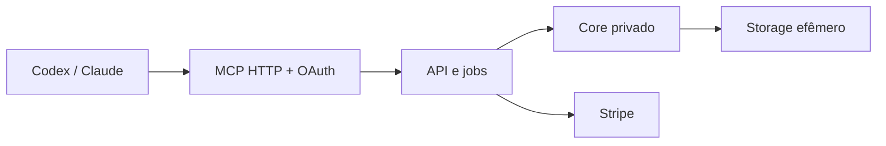

# Roadmap

Este documento organiza a evolução do `midi.arranger.cli` desde o maquinário local atual até um
produto comercial conectado à IA do próprio usuário.

A fonte de verdade de comportamento continua em
[`docs/objetivo.md`](objetivo.md) e [`docs/arquitetura.md`](arquitetura.md). Este arquivo define
**ordem, escopo e critérios de passagem entre fases**.

---

## Visão do produto

O produto recebe um MIDI existente e uma intenção musical. A IA que o usuário já utiliza pesquisa
referências públicas, identifica características abstratas de performance e coordena o fluxo. O
maquinário determinístico traduz essas características para técnicas próprias, constrói ou remodela
o MIDI e comprova o resultado.

A ferramenta trabalha com **influências, técnicas e comportamento**, nunca com reprodução de
melodia, riff, groove, progressão, transcrição ou arranjo reconhecível de uma obra.

### Fronteira fundamental

| Parte | Responsabilidade |
|---|---|
| IA do usuário | entrevista, pesquisa, interpretação, decisões e revisão |
| Contrato de influência | fontes, findings normalizados, confiança e achados não mapeados |
| Compilador semântico | de-para determinístico entre traços e técnicas executáveis |
| Core | análise, criação, remodelagem, humanização e render |
| Validadores | conformidade, não-cópia, harmonia, placement, persona, artificialidade e colisão |

Nenhum LLM é necessário no backend.

---

## Estado atual — 2026-08-31

A fundação já separa o harness não determinístico das tools determinísticas.

Capacidades presentes na `main`:

- analyze, brief.validate, plan.skeleton, plan.validate, render, validate,
  techniques.list, techniques.describe e plugins.scan;
- 18 técnicas executáveis: 8 de bateria, 6 de baixo e 4 de teclas;
- 15 roles renderizáveis, incluindo criação de bateria e baixo, elementos harmônicos e parte do
  eletrônico rítmico;
- autorização explícita de técnicas;
- schemas anticópia estruturais;
- render determinístico e preservação de tracks não declaradas.

Lacunas que impedem chamar o produto de MVP reference-driven:

- o catálogo ainda não distingue com clareza técnica documentada de técnica executável;
- a pesquisa ainda não produz um contrato intermediário de influência;
- falta o compilador semântico de influência para técnicas;
- parâmetros ainda vivem majoritariamente no nível da família, não da técnica;
- conformidade e não-cópia comportamental estão pendentes;
- a propagação completa do perfil de estilo e a densidade por seção ainda têm pendências;
- falta uma prova ponta a ponta e um test-drive local.

---

## Milestones existentes

### M1 — Fundação determinística

Estado: concluído.

Entregou contratos, registry, CLI de tools, análise, plano, render, validadores básicos e garantias de
determinismo/preservação.

### M2 — Harness multi-provider

Estado: concluído.

Entregou instalação, brief interativo, loop autônomo, prompts por provider e estado em disco.

### M3 — Estilo e técnicas

Estado: em andamento.

Foco atual:

- [#5 — validador de conformidade](https://github.com/OvictorVieira/midi.arranger.cli/issues/5);
- [#11 — parametrização completa pelo perfil](https://github.com/OvictorVieira/midi.arranger.cli/issues/11);
- [#14 — técnicas de teclas](https://github.com/OvictorVieira/midi.arranger.cli/issues/14);
- [#15 — validador de não-cópia](https://github.com/OvictorVieira/midi.arranger.cli/issues/15);
- [#32 — anotações locais no MIDI](https://github.com/OvictorVieira/midi.arranger.cli/issues/32);
- [#45 — densidade de ghost note por seção](https://github.com/OvictorVieira/midi.arranger.cli/issues/45).

M3 pode continuar entregando técnicas, mas M6 define quais delas são necessárias para validar o
produto com um músico.

### M4 — Criação e aprendizado

Estado: em andamento.

- criação de bateria e baixo do zero foi entregue;
- [#17](https://github.com/OvictorVieira/midi.arranger.cli/issues/17) fecha a decisão de criar família
  ausente e o respeito a vetos;
- [#18](https://github.com/OvictorVieira/midi.arranger.cli/issues/18) adicionará aprendizado por corpus
  próprio;
- [#19](https://github.com/OvictorVieira/midi.arranger.cli/issues/19) cobre guitarra.

Corpus próprio e guitarra completa ampliam o produto, mas não bloqueiam o primeiro teste
reference-driven quando a ausência de suporte é declarada honestamente.

### M5 — Eletrônico e transições

Estado: em andamento e não bloqueante para M6.

Parte do eletrônico rítmico já existe. Permanecem
[#22](https://github.com/OvictorVieira/midi.arranger.cli/issues/22),
[#23](https://github.com/OvictorVieira/midi.arranger.cli/issues/23) e
[#24](https://github.com/OvictorVieira/midi.arranger.cli/issues/24).

---

## M6 — MVP orientado por influências com a IA do usuário

Tracking: [epic #80](https://github.com/OvictorVieira/midi.arranger.cli/issues/80).

### Resultado esperado

Um músico consegue:

1. instalar a ferramenta;
2. fornecer uma música em MIDI;
3. explicar a intenção e citar referências;
4. deixar a própria IA pesquisar fontes públicas;
5. revisar findings e o de-para para técnicas;
6. autorizar o conjunto;
7. receber um MIDI e um relatório rastreável;
8. comparar o resultado no DAW.

### Escopo suportado

- edição de bateria, baixo e teclas dentro do inventário executável;
- criação de bateria e baixo ausentes;
- elementos harmônicos e eletrônicos já disponíveis;
- pesquisa e coordenação pela IA do usuário;
- nenhuma IA hospedada pelo projeto.

### Backlog do contrato e compilação

- [#74 — catálogo de capacidades executáveis](https://github.com/OvictorVieira/midi.arranger.cli/issues/74);
- [#75 — InfluenceProfile v1](https://github.com/OvictorVieira/midi.arranger.cli/issues/75);
- [#72 — parâmetros e evidências por técnica](https://github.com/OvictorVieira/midi.arranger.cli/issues/72);
- [#73 — influence.compile](https://github.com/OvictorVieira/midi.arranger.cli/issues/73).

### Backlog de orquestração e prova

- [#76 — skill orientada por influências](https://github.com/OvictorVieira/midi.arranger.cli/issues/76);
- [#77 — relatório de proveniência](https://github.com/OvictorVieira/midi.arranger.cli/issues/77);
- [#79 — cenário ponta a ponta](https://github.com/OvictorVieira/midi.arranger.cli/issues/79);
- [#78 — doctor e test-drive](https://github.com/OvictorVieira/midi.arranger.cli/issues/78).

### Dependências existentes

M6 depende de #5, #11, #15, #17 e #45. Não depende da conclusão integral de guitarra, corpus próprio,
eletrônico ou anotações.

### Ordem recomendada

1. #74 e #75 em paralelo;
2. #72;
3. #73;
4. #11 e #45 em paralelo;
5. #76;
6. #5, #15 e #77;
7. #17;
8. #79;
9. #78;
10. validação auditiva em três músicas reais.

### Definition of Done

- nenhum recurso não implementado é oferecido como executável;
- toda influência pesquisada possui fonte, finding e confiança;
- todo finding vira técnica executável ou achado não mapeado explícito;
- nenhum parâmetro técnico é inventado pela IA;
- o usuário autoriza antes do render;
- conformidade mede o que foi solicitado;
- não-cópia estrutural sempre roda;
- comparação comportamental só roda com corpus legitimamente fornecido;
- mesmo input, seed e versões produzem MIDI e relatório byte-idênticos;
- tracks não declaradas permanecem nota a nota idênticas;
- `midi-arranger test-drive` conclui de ponta a ponta;
- três músicas reais passam pelo protocolo auditivo;
- a entrega contém MIDI, brief, InfluenceProfile, plano e relatório.

### Protocolo auditivo

Para cada música real, comparar:

1. MIDI de origem;
2. saída apenas com humanização baseline;
3. saída orientada por influência.

Registrar por família:

- fidelidade à intenção;
- naturalidade;
- preservação do que já funcionava;
- excessos de densidade/articulação;
- necessidade de edição manual;
- técnicas ou traços ainda não suportados.

O teste auditivo não substitui os validadores. Ele mede o que ainda é gosto e percepção musical.

---

## M7 — Plataforma comercial MCP com core privado

Tracking: [epic #81](https://github.com/OvictorVieira/midi.arranger.cli/issues/81).

M7 começa somente depois de M6 passar no uso real. A migração não deve mudar o contrato musical
validado; apenas trocar a forma de distribuição e operação.

### Arquitetura alvo

### Público

- skill mínima e instruções de fluxo;
- schemas MCP;
- catálogo semântico;
- intensidades abstratas;
- mensagens de erro e próximos passos.

### Privado

- receitas;
- valores e tabelas;
- dicionário de mapeamento;
- código do motor;
- validadores proprietários;
- estratégia de render.

### Workstreams

1. ADR e versionamento de contratos;
2. MCP Streamable HTTP;
3. OAuth 2.1 e scopes mínimos;
4. multi-tenancy;
5. uploads e downloads assinados;
6. armazenamento efêmero e exclusão automática;
7. fila de jobs, workers, timeout, quota e idempotência;
8. catálogo público sem receitas internas;
9. skill pública mínima para Codex e Claude Code;
10. Stripe Checkout, assinaturas, créditos e webhooks;
11. observabilidade, auditoria e suporte;
12. segurança de parsing/processamento MIDI;
13. termos, privacidade, retenção e takedown;
14. closed alpha com músicos convidados.

### Definition of Done

- usuário conecta o MCP via OAuth;
- a IA dele executa o fluxo validado no M6;
- o core não é distribuído;
- jobs e dados são isolados por tenant;
- MIDI tem retenção curta e auditável;
- cobrança é idempotente e reconciliável;
- Codex e Claude Code produzem o mesmo contrato semântico;
- alpha opera com métricas, suporte e políticas publicadas.

---

## Princípios permanentes

- IA do usuário é o cérebro; o projeto fornece maquinário.
- Pesquisa levanta técnica e comportamento, nunca conteúdo musical.
- Perfil pesquisado é por música, não uma base persistente de artistas.
- Número sem fonte ou convenção declarada não entra.
- Capacidade ausente é informada, nunca simulada por no-op.
- Usuário autoriza as técnicas.
- Origem nunca é sobrescrita.
- Determinismo e rastreabilidade são requisitos de produto.
- Nomes de artistas são referências fornecidas pelo usuário, não presets oficiais nem endosso.
